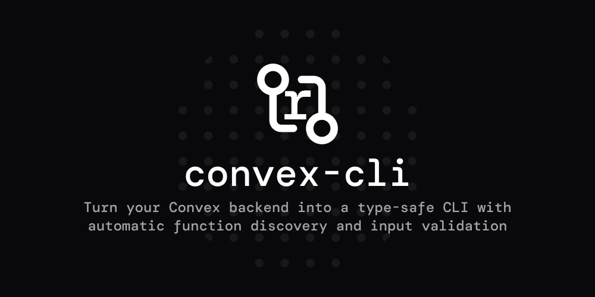

# Convex CLI

Create a fully type-safe CLI from your Convex API. Functions are discovered automatically and exposed as commands, making it easy to use your backend from the terminal or distribute access externally.

> **Note**: This is an independent project and is not officially affiliated with Convex or the Convex team.

## Features

- 🚀 **Type-Safe**: Leverages your Convex generated types for automatic argument validation
- 🔍 **AST-Based Discovery**: Intelligent TypeScript analysis using ts-morph for accurate function discovery
- 📝 **Smart Parsing**: Converts CLI arguments to proper Convex function inputs with type coercion
- 🎯 **Function Types**: Full support for queries, mutations, and actions
- 🏗️ **Modular Organization**: Functions organized by modules with kebab-case naming
- 🎨 **Zero Configuration**: Works out of the box with any Convex project

## Installation

```bash
npm install @ras-sh/convex-cli
# or
pnpm add @ras-sh/convex-cli
# or
bun add @ras-sh/convex-cli
```

## Quick Start

1. **Set up your Convex URL:**
```bash
export CONVEX_URL="https://your-deployment.convex.cloud"
# or for local development
export CONVEX_URL="http://localhost:3210"
# or use deployment name
export CONVEX_DEPLOYMENT="your-deployment-name"
```

2. **Create your CLI script:**
```typescript
// src/cli.ts
import { createCli } from "@ras-sh/convex-cli";
import { api } from "../convex/_generated/api.js";

createCli({ api }).run({ logger: console });
```

3. **Add CLI script to package.json:**
```json
{
  "scripts": {
    "cli": "tsx --env-file=.env.local src/cli.ts"
  }
}
```

4. **Run your Convex functions:**
```bash
# Query examples
npm run cli todos get-all
npm run cli health-check get

# Mutation examples
npm run cli todos create --text "Buy groceries"
npm run cli todos toggle --id "j57d6h3k66q0q0q0q0q0q0q0q0q0" --completed true

# Module functions (kebab-case conversion)
npm run cli todos delete-todo --id "j57d6h3k66q0q0q0q0q0q0q0q0q0"
```

## Usage

### Command Structure

The CLI automatically generates commands based on your Convex API structure. Functions are organized by module, with both module and function names converted to kebab-case for consistency.

```bash
# Module functions
your-cli <module-name> <function-name> [options...]

# Root-level functions
your-cli <function-name> [options...]
```

### Argument Handling

All function arguments are passed as command-line options using the `--` prefix. The CLI handles automatic type conversion and validation:

```bash
# String arguments
your-cli todos create --text "Buy groceries"

# Boolean arguments (automatic string-to-boolean conversion)
your-cli todos toggle --id "some-id" --completed true

# Convex ID arguments
your-cli todos delete-todo --id "j57d6h3k66q0q0q0q0q0q0q0q0q0"

# Complex arguments with kebab-case conversion
# Function parameter `firstName` becomes `--first-name`
your-cli users create-user --first-name "John" --last-name "Doe"
```

### Function Types

The CLI supports all Convex function types with appropriate annotations:

```bash
# Queries (read-only operations)
your-cli todos get-all               # (query)

# Mutations (write operations)
your-cli todos create --text "Task"  # (mutation)

# Actions (external API calls, etc.)
your-cli integrations sync-data      # (action)
```

### Function Discovery

The CLI uses TypeScript AST analysis with **ts-morph** to automatically discover your Convex functions:

- Parses `convex/_generated/api.d.ts` to extract module structure
- Analyzes TypeScript source files for function definitions and arguments
- Generates JSON schemas for type validation
- Supports complex nested object types and arrays
- Works with any valid Convex function signature

No manual configuration required - just run `npx convex dev` to generate types and the CLI will discover everything automatically.

## Configuration

### Environment Variables

The CLI supports multiple ways to configure your Convex deployment URL:

- `CONVEX_URL`: Direct URL to your Convex deployment (highest priority)
- `CONVEX_DEPLOYMENT`: Deployment name (constructs URL as `https://{name}.convex.cloud`)
- **Fallback**: `http://localhost:3210` for local development

```bash
# Production deployment
export CONVEX_URL="https://your-deployment.convex.cloud"

# Using deployment name (equivalent to above)
export CONVEX_DEPLOYMENT="your-deployment"

# Local development (default fallback)
# No environment variable needed
```

### Programmatic Configuration

```typescript
import { createCli } from "@ras-sh/convex-cli";
import { api } from "../convex/_generated/api.js";

const cli = createCli({
  api,                   // Your Convex API object (required)
  url: "...",            // Optional: Override environment URL
  name: "my-app-cli",    // Optional: CLI program name (default: "convex-cli")
  version: "1.0.0",      // Optional: CLI version
  description: "...",    // Optional: CLI description
});

// Basic usage
cli.run({ logger: console });

// Advanced usage with custom configuration
cli.run({
  logger: {
    info: (msg) => console.log(`[INFO] ${msg}`),
    error: (msg) => console.error(`[ERROR] ${msg}`),
  },
  process: process,      // Optional: custom process object
  argv: process.argv,    // Optional: custom argv
});
```
